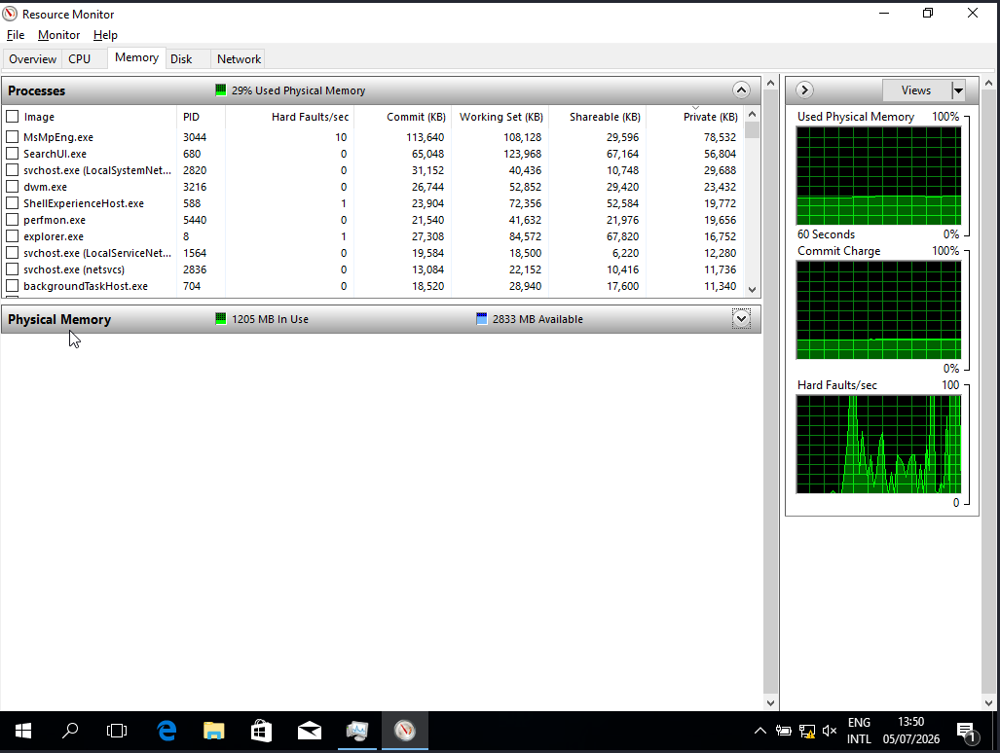

# Windows Processes and Threads

## Objectives:
> Understand how Windows executes a program and the relationship between Programs, Processes, and Threads.

## Topics Covered:
  - Program VS Process VS Thread
  - Windows Process Creation
  - Virtual Address Space
  - Primary Thread
  - Windows Scheduler (Overview)
  - Resource Monitor
## Practical Lab

  ### Environment
    > Status: Completed
    > Difficulty: Beginner
    > Estimated Study Time: 4 Hours
    - Windows 10 VM
    - Resource Monitor
    
  ### Top Memory Consuming Processes
  #### Resource Monitor
  
  
  | Process | Working Set |
  |----------|------------:|
  | MsMpEng.exe | 113.64 MB |
  | SearchUI.exe | 65.05 MB |
  | svchost.exe (LocalSystemNetwork) | 31 MB |
  | backgroundTaskHost.exe | 28.94 MB |
  | explorer.exe | 27.3 MB |
  | dwm.exe | 26.7 MB |
  | ShellExperenceHost.exe | 23.9 MB |
  | perfmon.exe | 21.54 MB |
  | svchost.exe (LocalServiceNetwork) | 19.58 MB |
  | svchost.exe (netsvcs) | 13.08 MB |

  > Note: Processes are explaind in Notes.md

  ## Observations

  - Windows creates isolated virtual memory for every process.
  - Multiple svchost.exe instances are expected.
  - Memory usage differs between Working Set and Private Bytes.
  ``` 
  Working Set measures physical memory (RAM) currently active for a process, while Private Bytes measures virtual memory allocated exclusively to that process, regardless of whether it sits in RAM or has been swapped to the pagefile on your hard drive.
  ```
  
## Key Takeaways

- A Program is a static executable.
- A Process is a running instance with its own memory and resources (like virtual address space, Process ID, Security Token, Handle Table, Environment Variables, at least one Thread, and Loaded DLLS).
- Threads are the execution units scheduled by Windows.

## Challenges

Initially I confused Windows process creation with thread pools. After reviewing the Windows architecture, I understood that thread pools belong to applications rather than the operating system process creation mechanism. I explained it in the following process starting after double-clicking notepad.exe:
```
  1- CMD calls CreateProcess()
  
  ↓
  
  2- Windows Kernel checks the file
  
  ↓
  
  3- Create EPROCESS object
  
  ↓
  
  4- Allocate Virtual Address Space
  
  ↓
  
  5- Map executable image into memory
  
  ↓
  
  6- Load required DLLs
  
  ↓
  
  7- Generate the Primary Thread
  
  ↓
  
  8- Assign an access token to the process.
  
  ↓
  
  9- Place the thread in the Ready Queue
  
  ↓
  
  10- Scheduler selects the thread. Dispatcher performs the context switch.
  
  ↓
  
  11- CPU begins executing the first instruction
  
  ↓
  
  12- Notepad Window appears
```
## Interview Questions

- What is the difference between a Program and a Process?
  > A program is a static executable, while a process is a running instance with its own memory and resources (like virtual address space, Process ID, Security Token, Handle Table, Environment Variables, at least one Thread, and Loaded DLLS).

- Does Windows schedule Processes or Threads?
  > Windows schedules the threads rather than the processes

- Why does Windows create multiple svchost.exe instances?
  > I think Windows creates multiple processes to isolate and safeguard the other tasks from crashes that may happen

- What is Virtual Address Space?
  > a simulated, contiguous range of memory addresses that the operating system provides to a program or process. It creates the illusion that each program has its own exclusive, large block of memory, while the operating system secretly maps these virtual addresses to actual physical hardware memory (RAM) or disk storage

- What is the role of the Primary Thread?
  > the default, initial thread of execution created when a program or application process starts. It is responsible for launching the application, executing the entry-point code, and coordinating the overall lifecycle of the process

## Skills Practiced

  - Windows Administration
  - Process Analysis
  - Resource Monitoring
  - Windows Internals
  - Troubleshooting

## References
  - Microsoft Learn
  - Windows Internals (Russinovich)
  - Microsoft Documentation
